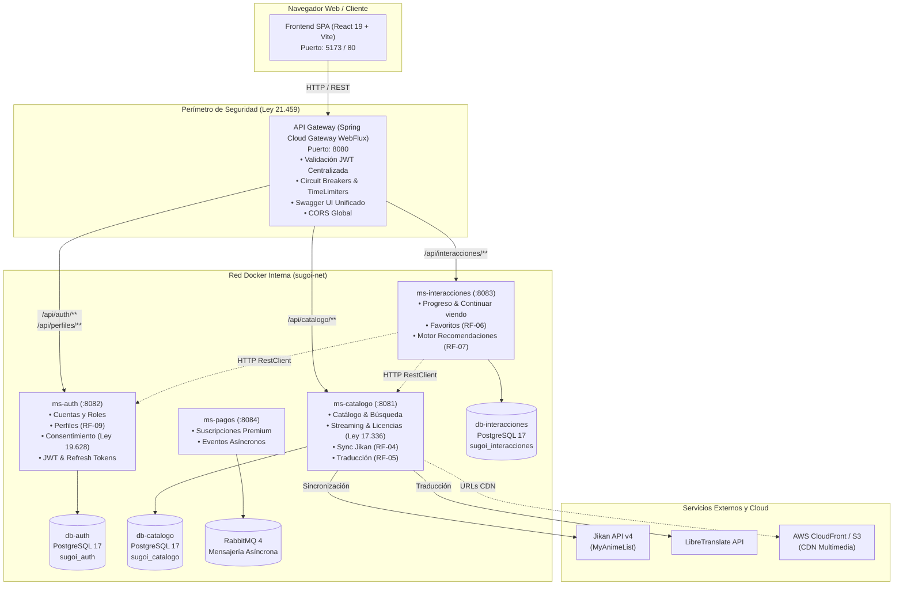

# SugoiAnime (すごいアニメ)
### Plataforma de Streaming de Anime Basada en Microservicios

**SugoiAnime** es una plataforma moderna de streaming y catálogo de anime diseñada bajo una **arquitectura de microservicios** distribuida, altamente escalable, resiliente y orientada al estricto cumplimiento normativo y legal chileno. 

El sistema incluye reproducción de video streaming, sincronización externa con metadatos de anime, gestión de identidades y perfiles familiares, seguimiento de progreso en tiempo real, favoritos y un **motor de recomendaciones personalizadas** basado en aprendizaje de contenido (Similitud de Coseno).

---

## 🏗️ Arquitectura del Sistema

El sistema implementa una arquitectura desacoplada orientada a microservicios:

---

## 📦 Mapa de Microservicios y Componentes

| Servicio / Contenedor | Puerto Interno (Docker) | Puerto Host (Dev) | Base de Datos / Storage | Responsabilidad Principal |
|---|:---:|:---:|---|---|
| **`gateway`** | `8080` | `8080` | N/A (Stateless) | Punto de entrada unificado, enrutamiento reactivo, filtro perimetral JWT, Resilience4j Circuit Breakers, CORS y documentación Swagger agregada. |
| **`ms-auth`** | `8082` | `5433` *(BD)* | `sugoi_auth` (PostgreSQL 17) | Gestión de identidades, emisión/rotación de tokens JWT, perfiles por cuenta y auditoría de consentimiento de datos personales. |
| **`ms-catalogo`** | `8081` | `5434` *(BD)* | `sugoi_catalogo` (PostgreSQL 17) | Catálogo de anime, géneros, gestión de episodios, streaming CDN y sincronización externa con Jikan. |
| **`ms-interacciones`** | `8083` | `5435` *(BD)* | `sugoi_interacciones` (PostgreSQL 17) | Registro de reproducciones, favoritos de usuarios y motor algebraico de recomendaciones personalizadas. |
| **`ms-pagos`** | `8084` | `5672 / 15672` *(MQ)* | RabbitMQ | Módulo para eventos asíncronos de membresías y suscripciones premium. |
| **`frontend`** | `80` | `5173` | Nginx / React SPA | Interfaz de usuario rica, reproductor HTML5 con control de posición y catálogo interactivo. |

---

## 🛠️ Stack Tecnológico

### Backend
- **Lenguaje:** Java 25 con hilos virtuales habilitados (*Project Loom / Virtual Threads*) para alto rendimiento en I/O bloqueante.
- **Framework Base:** Spring Boot 4.1.1.
- **Cloud & Resiliencia:** Spring Cloud 2025.1.3, Spring Cloud Gateway Server WebFlux, Resilience4j (CircuitBreaker y TimeLimiter).
- **Seguridad:** Spring Security con OAuth2 Resource Server (stateless JWT HMAC-SHA256).
- **Persistencia & ORM:** Spring Data JPA, Hibernate, HikariCP, Flyway para versionado de esquemas.
- **Caché:** Caffeine Cache local de alto rendimiento.
- **Mensajería:** Spring AMQP + RabbitMQ 4.
- **Documentación de API:** SpringDoc OpenAPI 3.1.0 / Swagger UI.

### Frontend
- **Librería Core:** React 19 + ReactDOM 19.
- **Enrutamiento:** React Router DOM v7.
- **Tooling & Bundler:** Vite 8.
- **Estilos:** Vanilla CSS modular con variables de diseño, modo oscuro cinematográfico y diseño responsivo.
- **Servidor Web Producción:** Nginx Alpine.

### Infraestructura y Datos
- **Bases de Datos:** PostgreSQL 17 Alpine (3 instancias independientes).
- **Contenedores:** Docker & Docker Compose con builds multi-etapa (*multi-stage builds*).

---
